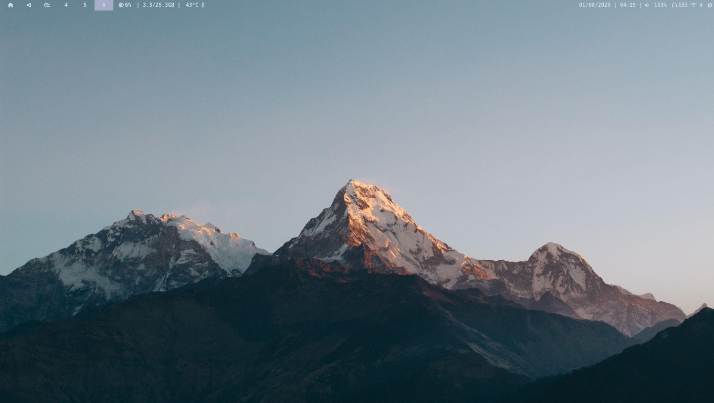
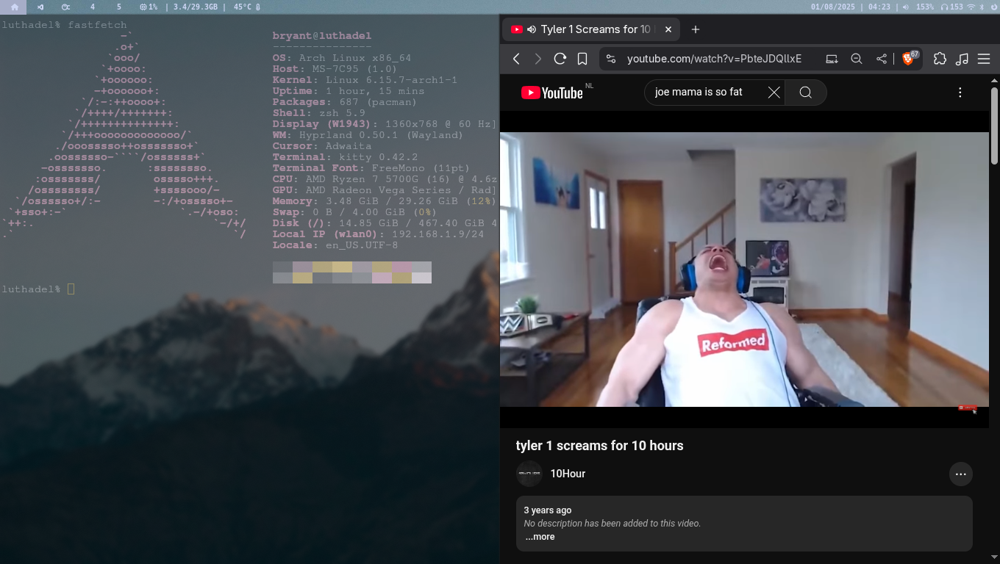
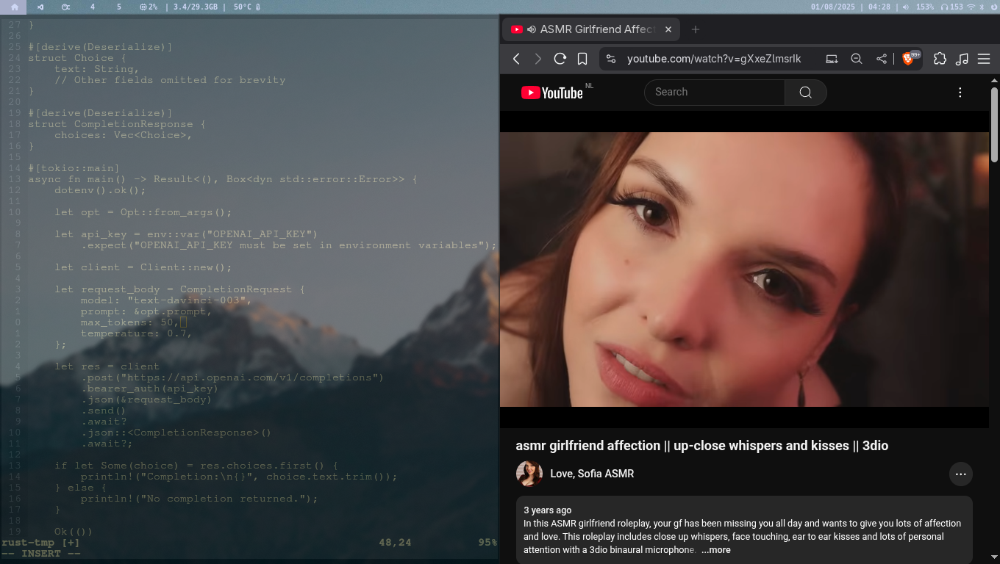

This repository contains my personal dotfiles for a customized Linux desktop environment. The setup is based on the Hyprland Wayland compositor and is designed to be both aesthetically pleasing and highly functional.

## Installation

The `install.sh` script is provided to automate the setup process. It will install the necessary packages using `pacman` and create symbolic links for all the configuration files in this repository to their appropriate locations in your home directory.

Before running the script, you should review its contents to ensure that it meets your needs and that you have the necessary permissions to install the packages.

To run the installation script, execute the following command in your terminal:

```bash
./install.sh
```

## Configuration

This setup uses a combination of applications to create a complete desktop environment. The following is a breakdown of the main components and their configurations:

### Window Manager

*   **Hyprland**: A dynamic tiling Wayland compositor that provides a modern and fluid user experience. The main configuration file is located at `hypr/hyprland.conf`.

### Terminal

*   **Kitty**: A fast, feature-rich, and GPU-based terminal emulator. The configuration file is located at `kitty/kitty.conf`.

### Text Editor

*   **Neovim**: A highly extensible and customizable text editor. The configuration is written in Lua and is located in the `nvim/` directory. It uses `lazy.nvim` for plugin management.

### Status Bar

*   **Waybar**: A highly customizable Wayland bar for Sway and Wlroots based compositors such as Hyprland. The configuration is located in the `waybar/` directory.

### File Manager

*   **Dolphin**: The default file manager for KDE Plasma, configured to be lightweight and minimalistic. The configuration file is located at `dolphinrc`.

### Application Launcher

*   **wofi**: A fast and lightweight application launcher for Wayland. It is configured in `hypr/hyprland.conf` to be launched with the `SUPER` + `Space` key combination.

### Logout Menu

*   **wlogout**: A simple and elegant logout menu for Wayland. The configuration is located in the `wlogout/` directory.

## Keybindings

The following are some of the most important keybindings defined in `hypr/hyprland.conf`:

| Keybinding | Action |
| :--- | :--- |
| `SUPER` + `T` | Open terminal (Kitty) |
| `SUPER` + `Q` | Close active window |
| `SUPER` + `M` | Exit Hyprland |
| `SUPER` + `F` | Open file manager (Dolphin) |
| `SUPER` + `V` | Toggle floating window |
| `SUPER` + `Space` | Open application launcher (wofi) |
| `SUPER` + `P` | Toggle pseudotiling |
| `SUPER` + `J` | Toggle split |
| `SUPER` + `SHIFT` + `S` | Take a screenshot of a region |
| `SUPER` + `left`/`right`/`up`/`down` | Move focus |
| `SUPER` + `1-9` | Switch to workspace 1-9 |
| `SUPER` + `ALT` + `1-9` | Move active window to workspace 1-9 |

## Theming

The theming of this desktop environment is designed to be consistent and visually appealing. The following are the main components of the theme:

*   **Wallpapers**: A collection of wallpapers is included in the `wallpapers/` directory. The wallpaper is set using `hyprpaper`, and the configuration is located at `hypr/hyprpaper.conf`.
*   **Waybar**: The Waybar status bar is styled using CSS. The theme is defined in `waybar/theme.css` and the overall style is in `waybar/style.css`.
*   **wlogout**: The logout menu is also styled using CSS. The style is defined in `wlogout/style.css`.
*   **Hyprland**: The Hyprland configuration in `hypr/hyprland.conf` includes settings for window decorations, such as borders, shadows, and blur effects.

## Screenshots






